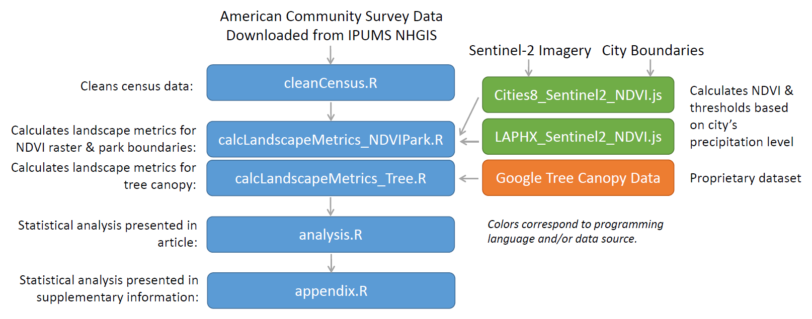

# The unequal connectivity of parks and tree canopy in 10 U.S. cities
This research quantifies the socioeconomic and spatial (in)equality in the distribution of park and tree canopy by examining the total area, patch area, and connectivity of these urban green spaces. Ten U.S. cities are tested: Chicago, IL; Houston, TX; Indianapolis, IN; Jacksonville, FL; Los Angeles, CA; New York, NY; Phoenix, AZ; Portland, OR; Seattle, WA; and Saint Louis; MO. Analysis utilizes publicly available satellite, park, and census data along with proprietary tree canopy data from Google's [Environmental Insights Explorer](https://insights.sustainability.google/). 

## Citation:
Stuhlmacher, M. and Kim, Y. (In Press) "The unequal connectivity of parks and tree canopy in 10 U.S. cities". Urban Forestry & Urban Greening. 

## Methodology Diagram:

# Software Requirements:
R version 4.0.2

Google Earth Engine (JavaScript API)
